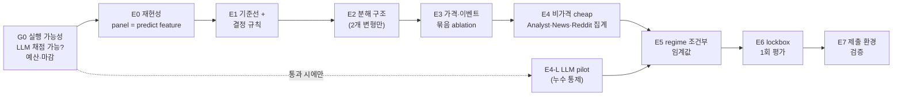

# 최종 파이프라인 및 실험 설계 — 검토·수정본

> 원안: "Premarket gap 기준선 → 5-class 분해 → 가격·이벤트 증분 검증 → LLM 비정형 screening → DG → TTA" 순의 단계적 실험 설계
> 근거 자료: `eda/00~04` 노트북 결과, EDA 분석 보고서, 추가 검증 실험 (2026-10-05 기준)

---

## 0. 한눈에 보기

**원안의 뼈대(갭 기준선 고정 → 복잡도를 단계적으로 올림 → 매 단계 paired Δscore로 채택)는 유지함.**
다만 아래 다섯 가지는 고치지 않으면 실험 결과를 믿을 수 없거나 제출이 불가능함.

| # | 핵심 수정 | 이유 한 줄 |
|---|---|---|
| 1 | **LLM feature는 "채점 환경에서 계산 가능한가"를 먼저 확인** | `predict(day)`는 `dataset/` + `artifacts/`만으로 돌아야 함. 10월 뉴스의 LLM 결과는 미리 만들어 둘 수 없음 |
| 2 | **LLM의 사전 지식 누수(look-ahead)를 통제** | 2024~2026 뉴스를 그 이후를 학습한 LLM에 넣으면, 모델이 이미 아는 주가 반응이 feature로 샘 |
| 3 | **최종 확인용 lockbox 구간(2026-06-01 ~)을 따로 떼어 한 번만 씀** | 단계가 8개, 후보가 수십 개라 같은 검증 구간을 반복해 쓰면 검증 구간에 과적합됨 |
| 4 | **결정 규칙(임계값) 최적화를 feature 실험보다 앞에 둠** | 점수는 예측 분포에 민감함(분모 E). 결정 규칙이 고정되지 않으면 feature 효과와 섞임 |
| 5 | **DG·TTA는 "단계"가 아니라 "선택 기준"과 "regime feature"로 축소** | 50종목 × 2년으로는 Group DRO·worst-domain 최적화가 과적합됨. TTA-lite는 사실상 당일 시장 feature임 |

---

## 1. 원안에서 그대로 유지하는 것

- **갭 규칙(`label_of(k × gap)`)을 모든 실험의 기준선으로 고정** — EDA에서 ML이 이 규칙을 이기지 못함 (13개 분할 평균 0.480 vs 0.474)
- **Candidate − Baseline의 paired Δscore로 판단** — 아래 3절에서 보듯 paired 비교가 비paired보다 약 10배 정밀함
- **10 seen + 10 unseen mixed-universe 검증** — 실제 채점 구성과 같음
- **Inner tune / Outer validation 분리, validation 결과로 재조정 금지**
- **flip 지수와 예측 급등락 비율을 score와 함께 보고**
- **Analyst에는 LLM을 쓰지 않음** — 이미 구조화된 데이터임

---

## 2. 비판점

심각도: 🔴 치명 (고치지 않으면 결과·제출이 무효) · 🟠 중요 (결론이 왜곡될 수 있음) · 🟡 개선

### 2.1 실행 가능성

| 심각도 | 원안 | 문제 | 근거 |
|---|---|---|---|
| 🔴 | E4-B·C: News·Reddit을 LLM API로 feature화 | 채점은 공개하지 않은 10월 데이터로 `predict(day)`만 돌림. LLM feature를 쓰려면 **채점 중에 API를 호출**해야 하는데, 채점 환경에 네트워크·API 키가 있다는 보장이 없음 | 과제 규칙: "`load_model()`은 `artifacts/`만 읽어야 함. 채점 환경에는 `dataset/` 외 파일이 없음" |
| 🔴 | News-LLM: event parser | **사전 지식 누수.** LLM의 학습 데이터가 2024~2026 시장 반응을 포함하면, "이 뉴스는 악재"라는 판단에 실제 주가 결과가 섞임. 검증 점수는 오르지만 10월에는 재현되지 않음 | 금융 NLP에서 알려진 look-ahead bias |
| 🟠 | LLM 비용 | 뉴스 320만 건(중복 제거 후 약 68%), Reddit 3,800만 건. 팀 API 예산은 14만 원이고 그중 절반 사용이 권장됨 | 과제 PDF 2쪽 |
| 🟠 | 뉴스 커버리지 | AMZN·JNJ·V는 매칭된 기사가 0건이고, 본문은 7.5%만 있음. 새 종목 10개도 0건일 수 있음 | 02_events · 3절 |

### 2.2 통계·검증 설계

| 심각도 | 원안 | 문제 | 근거 |
|---|---|---|---|
| 🔴 | 모든 단계를 같은 temporal fold(A·B·C)로 평가하고 E7에서 최종 비교 | 후보 수십 개를 같은 구간에서 고르면 최종 점수가 **선택 편향으로 부풀려짐**. 한 번도 보지 않은 구간이 없음 | 원안 12·15절 |
| 🟠 | paired bootstrap CI | 방향은 맞지만 **블록 단위**가 명시되지 않음. 같은 날의 종목들은 시장 충격을 공유하므로 날짜 단위로 묶어 두 모델에 **같은 표본**을 써야 함 | — |
| 🟠 | 채택 기준이 "의미 있게 양수" 등 정성적 | 검출 가능한 효과 크기를 기준으로 수치를 정해야 함. 아래 실측: 비슷한 규칙끼리의 paired Δscore 표준오차는 **0.003(50종목) ~ 0.005(20종목)** | 추가 실험 (2026년 구간, 175일, 날짜 block bootstrap 400회) |
| 🟡 | 다중 비교 | E3만 9단계, E4·E5·E6까지 합치면 비교가 30회 이상임. 5% 기준으로 우연히 1~2개가 통과할 수 있음 | — |

> **이전 보고서 정정:** EDA 보고서에서는 비paired 표준오차(0.025~0.035)를 근거로 "Δscore ±0.03은 구분할 수 없다"고 썼음.
> 같은 날짜·종목에서 비교하는 paired 표준오차는 0.003~0.005라서, 변동성 묶음의 Δscore −0.027 같은 값은 **노이즈가 아니라 실제 악화일 가능성이 큼**. 반대로 gating 실험의 +0.002는 여전히 노이즈 범위임.

### 2.3 실험 내용

| 심각도 | 원안 | 문제 | 근거 |
|---|---|---|---|
| 🟠 | E1의 B3·B4(회귀, 5-class 분류기)에 결정 규칙이 없음 | 같은 분류기라도 결정 규칙에 따라 점수가 크게 달라짐. 기대 벌점 최소화 0.43 vs 회귀 + k 0.51 (같은 구간) | 04_validation 설명, 실험 로그 |
| 🟠 | E2 D3 safety rule (급등락이지만 방향 확신이 낮으면 1·3으로 낮춤) | flip은 줄지만 **급등락 예측 비율이 줄어 분모 E도 작아짐**. score가 오히려 떨어질 수 있음. 보합 행 40%만 급상승으로 바꿔도 0.862 → 0.879가 됨 | 00_score · 5절 |
| 🟠 | E2 Direction + Magnitude 분해 | EDA 사전 실험에서 "부호 × 크기 회귀" 분해는 세 구간 중 두 구간에서 단일 회귀보다 낮았음 (분해 vs 단일: 0.376 vs 0.400, 0.389 vs 0.386, 0.521 vs 0.537). 방향 정보는 사실상 갭 부호뿐임(수익률 lag-1 자기상관 −0.006) | 실험 로그 |
| 🟠 | E3 순차 ablation P0 → P8 | 결과가 **넣는 순서에 의존함**. 또 zgap = gap ÷ vol20이라 P2 다음 P3는 중복이고, abs_gap은 트리 모델에서 gap과 중복임 | — |
| 🟠 | E3·E4를 어떤 모델로 평가하는지 미정 | E2 결과에 따라 평가 모델이 바뀌면 E3 결과를 다시 내야 함 | — |
| 🟠 | E5 DG2·DG3·DG4 | "temporal-domain 평균 − 변동성 기준 선택", "worst-domain 고려"는 방법이 아니라 **모델 선택 기준**임. 반기 단위 domain은 약 125일씩이라 worst-domain 추정이 불안정함. DG1(종목 ID 미사용)은 실험이 아니라 이미 전제임 | — |
| 🟠 | E6 TTA-lite (당일 20종목의 vol·갭 분포로 threshold 조정) | test-time adaptation이 아니라 **당일 시장 regime feature에 따른 조건부 임계값**임. 학습할 때도 20종목 부분집합으로 계산해야 분포가 맞음. 변동성 구간별 k 사전 실험은 +0.002(paired SE 0.0025)로 노이즈 수준 | 추가 실험 |
| 🟡 | Reddit LLM 대상 선정에 "큰 gap day" 포함 | 선정 자체가 갭에 조건부라, 그 표본에서 본 효과를 전체로 일반화할 수 없음 | — |
| 🟡 | 최종 ablation 표 10행 × 9열 | 행마다 검정이 하나씩 붙어 다중 비교가 커지고, "Selected" 칸은 무엇이 선택됐는지 알 수 없음 | 원안 16절 |
| 🟡 | 제출 제약 미반영 | 채점자는 `model.py` 외 `src/`를 원본으로 덮어씀. 전처리 코드도 `model.py` 안에 있어야 하고, 하루 예측 시간도 고려해야 함 | 과제 README |

---

## 3. 수정된 설계

### 3.1 연구 질문 (수정)

> **Premarket gap 규칙을 기준선으로, (1) score-aware 결정 규칙, (2) 가격·이벤트 feature, (3) 채점 환경에서 계산 가능한 비가격 feature가 미래 × 미공개 종목의 score를 paired 기준으로 개선하는가?**

비가격 데이터는 다음 질문으로 평가함.

> **같은 갭 조건에서, 비가격 데이터가 방향(D) 또는 크기(M)에 대해 갭에 없는 정보를 주는가?**

### 3.2 데이터 분할

```text
대상일   2024-08-14 ─────────────────────────── 2026-05-31 │ 2026-06-01 ── 2026-09-14
         │                개발 구간 (dev)                  │   lockbox (73일, 3,650행)
         │  Fold A 평가 2025-07 ~ 2025-10                   │   최종 1회만 사용
         │  Fold B 평가 2025-11 ~ 2026-02                   │
         │  Fold C 평가 2026-03 ~ 2026-05                   │
```

| 항목 | 규칙 |
|---|---|
| 학습 | 각 fold 평가 시작일 14일 전까지 확장(expanding) |
| 평가 종목 | fold마다 20종목 = 학습에 쓴 10종목(seen) + 학습에서 뺀 10종목(unseen). unseen 세트를 3번 바꿔 반복 |
| 종목 교차 feature | 학습·평가 모두 **그날 20종목만으로** 계산 (시장 갭, gap_rank, regime feature) |
| Inner tune | k·임계값·하이퍼파라미터는 학습 구간의 마지막 20%에서만 고름 |
| Lockbox | 모든 결정이 끝난 뒤 최종 후보 1~2개와 기준선만 한 번 평가함. 결과를 보고 다시 고치지 않음 |
| 금지 | 같은 기간을 공유하는 종목 holdout 단독 판단 (날짜 단위 feature가 새어 Reddit이 +0.10으로 부풀려졌음) |

### 3.2.1 Lockbox 오염 방지 (2026-10-05 개정)

**현재 상태: lockbox(대상일 2026-06-01 ~ 2026-09-14)는 이미 일부 노출됨.** 데이터셋 안에 한 번도 안 본 구간은 남아 있지 않으므로, lockbox를 옮기지 않고 **노출 이력을 기록한 채 더 이상의 노출을 코드로 막음**. 진짜로 처음 보는 구간은 채점 구간(10월)뿐임.

| 노출 | 내용 | 노출된 모델 계열 |
|---|---|---|
| EDA 노트북 00~04 | 전체 기간 통계, 04의 시간 + 종목 평가가 2026-01 ~ 2026-09 | 갭 규칙, 가격·비가격 feature 묶음 |
| EDA 보고서 검증 | 2026-01 이후 bootstrap·gating·paired SE. k = 5.25를 이 구간으로 고름 | 갭 규칙 |
| `main.py eval --split 2026-06-01` | 기본 갭 규칙의 lockbox score 0.5768을 봄 | 갭 규칙 |

**해석 원칙**

- 갭 규칙 계열의 lockbox **절대 점수는 처음 보는 구간의 추정이 아님**. 보고서에 이 표와 함께 밝힘
- lockbox의 주 결과는 **최종 후보 − 기준선의 paired Δ**임. 두 모델 모두 lockbox 이전 데이터로만 다시 학습하고(k도 DEV에서 다시 고름), 후보의 설계가 lockbox를 보고 정해지지 않았다면 Δ는 해석할 수 있음
- EDA에서 얻은 정성적 결론("갭이 가장 강함")은 lockbox를 포함한 기간에서 나왔다는 점도 함께 밝힘

**코드로 막는 것** (`exp/lockbox.py`가 유일한 기준, 장부는 `exp/lockbox_ledger.json`)

| 진입점 | 동작 |
|---|---|
| 연구용 패널 `universe_panel` · EDA `build_panel` | 기본으로 lockbox 행을 빼고 돌려줌 |
| 분석 · LLM 표본 · E0/G0 점검 | DEV 날짜만 씀 |
| config | `lockbox_start`를 config로 바꿀 수 없음. DEV fold가 lockbox와 겹치면 멈춤 |
| `main.py eval` | 평가 구간이 lockbox 이전에서 끝남(`--until` 기본값). lockbox 채점은 `--allow-lockbox`가 필요하고 장부에 기록됨 |
| E6 실행 | ① `freeze`로 후보 spec 지문을 고정, 각 spec은 DEV 실행 기록이 있어야 함 → ② `run`은 고정한 계획과 같을 때만, **한 번만** 실행됨. 재실행은 `--force-lockbox`로만 가능하고 장부·보고서에 "오염"으로 남음 |
| `export` | lockbox 평가 전에는 lockbox 기간을 학습에 넣을 수 없음 (`--allow-lockbox`는 노출로 기록) |
| 보고서 | lockbox 결과 `report.md`에 노출 이력이 자동으로 붙음 |

### 3.3 단계 흐름



견고성 기준(원안 DG2·DG3)은 단계가 아니라 **E1~E5 전체의 선택 규칙**으로 씀 (3.5절).

### 3.4 단계별 상세

#### G0 — 실행 가능성 확인 (실험 전)

| 확인 항목 | 통과하지 못하면 |
|---|---|
| 채점 환경에서 `predict(day)` 안의 외부 API 호출 허용 여부 (교수·조교 확인) | E4-L 전체 생략. 비가격 데이터는 집계 feature만 사용 |
| LLM 비용 추정: pilot 표본(예: 2,000건)으로 건당 비용 × 필요 건수 | 표본 크기를 줄이거나 생략 |
| 제출 마감과 팀 인원 | 단계 E5 이후를 선택 사항으로 둠 |

#### E0 — 재현성 (원안 E0 유지 + 1개 추가)

- 원안 항목: label 일치, 갭 일치, 09:00 봉 제외, 실적 mapping, rolling 미래 미포함, 당일 universe만 사용
- **추가:** `model.py` 안의 하루 단위 feature 함수와 EDA 벡터 패널이 표본 날짜에서 같은 값을 내는지 대조함 (`check_against_day_api` 확장)
- 통과 기준: mismatch 0, 최대 절대 오차 < 1e-9

#### E1 — 기준선과 결정 규칙

원안 B0~B4에 **결정 규칙을 명시하고**, 임계값 최적화를 이 단계로 앞당김.

| 모델 | 신호 | 결정 규칙 |
|---|---|---|
| B0 | — | 전부 보합 |
| B1 | gap | `label_of(gap)` |
| B2 | gap | `label_of(k × gap)`, k 1개 |
| B2+ | gap | **클래스 경계 4개 직접 최적화** (t₀ < t₁ < t₂ < t₃) |
| B3 | 회귀(gap feature) | `label_of(k × 예측)` |
| B4 | 5-class 분류(gap feature) | 확률 위에서 경계 최적화 (기대 벌점 최소화는 비교용으로만) |

- 보고: score, accuracy, direction, big_recall, big_prec, flip 지수, **예측 급등락 비율 / 실제 급등락 비율**
- 산출: 기준선 1개 확정 (예상 B2 또는 B2+). 이후 모든 단계는 **이 결정 규칙을 고정한 채** 신호만 바꿈

#### E2 — 분해 구조 (원안 4개 → 2개)

| 모델 | 구조 |
|---|---|
| D0 | E1 기준선 |
| D2 | Move(보합 vs 움직임) + Extreme(일반 vs 급등락) + Direction(= 갭 부호 또는 분류기) → 경계 최적화로 5-class 복원 |

- D1(3-class magnitude)은 D2의 특수형이라 생략함
- **D3 safety rule은 별도 모델이 아니라 D2의 결정 경계 탐색 공간에 포함**함. 이렇게 하면 점수와 flip의 균형을 탐색이 직접 정하고, 분모 E 효과도 함께 반영됨
- 판정: paired Δscore와 flip 지수를 함께 봄. **flip이 줄어도 Δscore가 −2 SE 아래면 채택하지 않음**

#### E3 — 가격·이벤트 묶음 ablation (순차 9단계 → 묶음 4개)

| 묶음 | feature | EDA상 역할 |
|---|---|---|
| core | gap, gap_rank | 방향 + 크기 |
| scale | vol5, vol20, atr14, big_rate60, zgap | 크기 (종목 위험 수준) |
| cross | mkt_gap, resid_gap, beta(1 쪽으로 수축) | 종목 고유 충격 |
| event | earn, surp_sign, surp_abs, surp_pct_w(±50%) | 사건성 크기 |

- 방법: **forward(core + 묶음 1개)**와 **leave-one-group-out(전체 − 묶음 1개)**을 둘 다 잼. 두 결과가 같은 방향일 때만 판단함
- 평가 모델: E2에서 채택된 구조로 고정함

#### E4 — 비가격 데이터 (집계 feature)

| 데이터 | feature | 조건부 분석 |
|---|---|---|
| Analyst | up·down 건수, 목표가 변화율, 갭 부호와의 일치 여부 | 같은 갭 절댓값 구간 안에서 비교 |
| News-basic | 중복 제거 건수의 비정상 관심도(EMA₂₀ 대비), tone 꼬리값, `news_missing` 표시 | 갭과 tone 부호가 엇갈리는 경우의 갭 이후 움직임(rest) |
| Reddit-count | 언급량 z, subreddit 활동량 | 크기(M)에 대한 효과만 따로 봄 |

- 판정 대상: E3 채택 모델 대비 paired Δscore, 그리고 M·D 각각에 대한 증분

#### E4-L — LLM pilot (G0 통과 시에만)

| 단계 | 내용 |
|---|---|
| 누수 통제 | 회사명·티커·날짜를 가린 **익명화 제목**만 입력함. 이벤트 분류만 시키고 "주가에 좋은가"는 묻지 않음 |
| 누수 검정 | 같은 기사로 (a) 익명화 입력과 (b) 원문 입력의 성능을 비교함. (b)만 좋으면 사전 지식 누수로 판단 |
| 표본 | 먼저 갭이 작은 날(갭 절댓값 하위 60%)의 대표 기사로 pilot. 갭에 조건부로 고른 표본임을 결과에 명시 |
| 출력 | event_type, 부호, severity, unexpectedness (원안 항목 축소) |
| 중단 기준 | pilot에서 M·D 어느 쪽에도 갭 조건부 차이가 없으면 확장하지 않음 |

Reddit-LLM은 E4의 Reddit-count가 크기(M)에 대해 paired 기준을 통과할 때만 진행함. EDA 단계의 시간 + 종목 Δscore는 −0.040이었음.

#### E5 — regime 조건부 임계값 (원안 E6 TTA-lite)

| 모델 | 방법 |
|---|---|
| T0 | 전역 경계 (E1~E4 결과) |
| T1 | 당일 20종목의 median vol20 또는 median 갭 절댓값 삼분위별로 **크기 경계만** 따로 둠. 방향 경계는 고정 |
| T2 | 크기 경계를 regime 값의 단조 함수로 둠 (파라미터 1~2개) |

- regime 값은 학습할 때도 무작위 20종목 부분집합으로 계산함
- 원안 T3(continuous calibration)는 T2와 같고, T4(full TTA)는 제외함

#### E6 — lockbox 1회 평가

- 대상: 기준선(E1) vs 최종 후보 최대 2개. 두 spec 모두 DEV 실행 기록이 있어야 함
- 순서: `python -m exp freeze configs/e6_lockbox.toml` (사전 등록) → `python -m exp run configs/e6_lockbox.toml` (1회)
- 학습: 두 모델 모두 lockbox 시작 14일 전까지의 데이터로만 다시 학습함 (k·경계도 이 데이터로 다시 고름)
- 보고: **paired Δscore와 95% CI가 주 결과**. flip 지수, 예측 급등락 비율, 노출 이력(3.2.1)을 함께 실음. 갭 규칙 계열의 절대 점수에는 "노출됨" 표시
- **lockbox 결과가 dev 결과와 반대면 기준선을 제출함**
- lockbox 평가가 끝난 뒤에만 E7에서 lockbox 기간을 학습에 넣음

#### E7 — 제출 환경 검증

- [ ] feature 함수·결정 규칙이 모두 `src/model.py` 안에 있음
- [ ] `artifacts/`에는 파라미터(JSON)와 학습된 가중치만 있음
- [ ] `main.py check` / `main.py eval --split 2026-06-01` 통과
- [ ] 갭 누락·뉴스 0건·새 종목일 때 에러 없이 보합(2)으로 대체됨
- [ ] 하루 예측 시간 측정 (뉴스·Reddit을 쓰면 parquet 읽기 비용 확인)

### 3.5 통계 평가와 채택 기준

**공통 계산**

- Δscore = score(candidate) − score(baseline), **같은 날짜·종목**
- 신뢰구간: 날짜 단위 block bootstrap (두 모델에 같은 재표본), 400회 이상
- 기준 표준오차: 비슷한 규칙끼리 0.003(50종목) ~ 0.005(20종목). 구조가 다른 모델끼리는 더 클 수 있으므로 매번 직접 계산함

**판정 규칙**

| 결정 | 조건 (모두 만족) |
|---|---|
| ✅ 채택 | ① 3개 fold 모두 Δscore > 0 ② fold를 합친 paired 95% CI 하한 > 0 ③ unseen 종목만 따로 봐도 Δscore > 0 ④ flip 지수가 기준선 + 0.02 이하 ⑤ 예측 급등락 비율이 기준선의 ±25% 안 |
| ⏸ 보류 | ①~③ 중 2개만 만족, 또는 비용 대비 효과(Δscore 0.005 미만)가 낮음 |
| ❌ 제외 | 2개 이상의 fold에서 Δscore < 0, 또는 CI 상한 < 0 |

**다중 비교 관리**

- 후보 목록을 실험 전에 이 문서에 고정함 (E2 1개, E3 4개, E4 3개, E5 2개 = 10개)
- 목록에 없는 후보를 추가하면 "탐색적"으로 표시하고 lockbox 대상에서 뺌

### 3.6 최종 결과표 (원안 16절 간소화)

| 모델 | 구성 | Δscore (dev, 95% CI) | flip | 예측 급등락 비율 | lockbox score |
|---|---|---|---|---|---|
| B | 갭 + 결정 규칙 (E1) | 기준 | | | |
| +S | B + E2 분해 (채택 시) | | | | |
| +F | +S + E3 채택 묶음 | | | | |
| +N | +F + E4 채택 데이터 | | | | |
| +R | +N + E5 regime 임계값 | | | | |

"채택 묶음" 칸에는 실제 feature 이름을 적음. 채택되지 않은 단계는 행을 지우지 않고 "미채택"과 Δscore를 남김. 미채택 근거도 결과임.

---

## 4. 원안 → 수정본 대응표

| 원안 | 수정본 | 바뀐 점 |
|---|---|---|
| — | G0 | 신설: LLM 채점 가능성, 예산, 마감 확인 |
| E0 | E0 | `model.py` 하루 함수와 패널의 대조 추가 |
| E1 B0~B4 | E1 | 결정 규칙 명시, 클래스 경계 최적화(B2+)를 앞당김 |
| E2 D0~D3 | E2 D0·D2 | D1 생략, D3를 결정 경계 탐색에 흡수 |
| E3 P0~P8 순차 | E3 묶음 4개 | forward + leave-one-group-out |
| E4 Analyst·News-LLM·Reddit-LLM | E4 집계 → E4-L 조건부 | LLM은 G0 통과 + 누수 통제 시에만 |
| E5 DG0~DG4 | 3.5절 선택 규칙 | 방법이 아니라 기준으로 축소 |
| E6 TTA T0~T4 | E5 T0~T2 | regime 조건부 크기 경계로 명확화 |
| E7 최종 비교 | E6 lockbox + E7 제출 검증 | 한 번만 쓰는 최종 구간 신설 |
| 16절 ablation 10행 | 3.6절 5행 | 다중 비교 축소, 구성 명시 |

---

## 5. 열린 질문

- [ ] 채점 환경에서 외부 API 호출이 허용되는가? (G0, 교수·조교 확인 필요)
- [ ] 제출 마감일과 중간 발표일
- [ ] LLM 예산 상한 (권장 7만 원 안에서 pilot 규모 결정)
