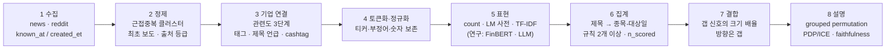

# 텍스트 데이터 중심 파이프라인 재구성

> 근거 강의: w4-2 텍스트 전처리 · w5-1 소셜 텍스트 감성분석 · w6-1 설명가능성과 언어모델
> 근거 실험: EDA, E1~E6 결과 (`runs/`), 2026-10-10 기준
> 관련 문서: `docs/experiment_design.md` (실험 설계), `docs/RUNBOOK.md` (실행 방법)

---

## 0. 한눈에 보기

**핵심 결정: 텍스트로 "방향"이 아니라 "크기"를 예측하고, 방향은 프리마켓 갭이 맡는다.**

| 결정 | 근거 |
|---|---|
| 1. 텍스트의 목표는 **크기(급등락 여부)** | 강의: 텍스트는 변동성(크기)은 예측해도 방향은 못 하는 경우가 많음 (w5-1 p25, p27). 실험: 뉴스 논조의 갭 이후 방향 정보는 0 (E4 조건부 표), 실적일은 같은 갭에서도 급등락 비율이 일관되게 높음 |
| 2. **문서 도착 건수(count)를 가장 강한 기준선으로** 두고, 모든 감성 feature 를 이것과 비교 | 강의 w5-1 p39. count 는 분류 오류·프롬프트 민감도·LLM 기억 누수가 없음 |
| 3. **기업 연결(entity linking)을 1순위 전처리로** | 실측: 종목 태그가 붙은 기사 중 제목에 그 회사(티커·이름)가 나오는 비율 **18%** (MS 6%, GS 8%). 나머지는 그 회사에 "관한" 기사인지 알 수 없음 (w4-2 p27, w5-1 p20) |
| 4. 텍스트 feature 는 회귀 입력이 아니라 **크기 판단의 배율(보정)** 로 넣음 | 실험: 날짜 단위 feature 를 회귀에 넣으면 날짜를 외워 크게 망가짐 (Reddit −0.080). 종목별 텍스트 feature 로 갭 신호의 크기만 조정하면 방향은 그대로 갭이 유지 |
| 5. 계층을 **제출 가능(deployable) / 연구용(research)** 으로 나눔 | 채점 환경은 `dataset/` + `artifacts/` 만 있음. FinBERT 가중치·LLM API 는 G0 미통과 → 연구용 |
| 6. 설명 가능성은 **grouped block permutation + PDP/ICE + faithfulness 검증**으로 | w6-1. 텍스트 feature 는 서로 강하게 상관(count·abn·tone 꼬리)되어 있어 단독 permutation 은 과소평가 |

**미리 알아 둘 제약: lockbox 는 이미 사용됨 (2026-10-10).** 이 재구성으로 생기는 새 후보는 깨끗한 lockbox 추정을 받을 수 없음. 그래서 채택 기준을 더 엄격하게 하고(8절), 이 파이프라인의 주 가치는 **점수 개선보다 방법론·설명(정성평가 30점)** 에 있다고 보고 설계함.

---

## 1. 강의 내용 → 우리 데이터 대응

| 강의 개념 | 우리 데이터에 적용 | 비고 |
|---|---|---|
| 수집 경로 4가지: 공시·콜·뉴스·소셜 (w4-2 p3) | **뉴스(GDELT 제목·tone) + Reddit** 만 있음 | 공시(EDGAR/DART)·실적콜 전사문은 데이터에 없음 → 공시 관련 기법(섹션 추출, boilerplate)은 뉴스 제목 수준으로 축소 |
| 측정량 3가지: 관심도·톤·합의도 (w4-2 p14) | 관심도 = 기사·게시물 수, 톤 = 제목 점수, 합의도 = 하루 안 점수 분산 | 세 값을 항상 따로 만듦 |
| 파이프라인 5단계: 수집→정제→토큰화→표현→집계 (w4-2 p16) | 그대로 채택 (3절) | 정제 단계의 결정이 이후 전부를 제한함 |
| 정규화 함정: 소문자화·부정어·숫자 (w4-2 p18, p21) | 티커 대소문자 유지, `not/no/without` 유지, `%`·`$`·숫자 보존 | 제목이 짧아서 부정어 하나가 의미를 뒤집음 |
| 일반 사전의 도메인 오류 (w4-2 p19, w5-1 p5) | GDELT tone 은 **일반 영어 사전 기반** → 금융 용어(cost, liability, tax)를 부정으로 셈 | Loughran-McDonald(LM) 금융 사전 점수를 별도로 만들어 비교 |
| 근접 중복 (w4-2 p17, p45) | 정규화 제목 해시로 중복 제거 중 (남는 비율 41~93%) | 문자 5-gram 근접 중복 + "최초 보도" 플래그로 확장 |
| 기업 연결 (w4-2 p27, w5-1 p20) | **제목 언급률 18%** | 관련도 3단계(태그만 / 제목 언급 / cashtag)로 나눠 측정 |
| 시간 정렬·lag rule (w4-2 p43, w5-1 p18, p34) | 이미 `known_at < 대상일 09:30` 으로 구현, E0 검증 통과 | 기사의 58%가 장 마감 후·개장 전에 도착 → 갭이 반응하는 바로 그 정보 |
| 문서 없음 ≠ 0 (w5-1 p19) | `news_missing` 은 있음. 톤은 기사 없으면 NaN 유지 | 채점 개수(`n_scored`)를 항상 함께 보존 |
| 집계 규칙이 측정의 일부 (w5-1 p16~17) | 최소 2개 규칙(평균, 꼬리 비율)을 같이 만들고 결론이 규칙에 의존하는지 확인 | — |
| 3세대 감성: 사전 → FinBERT → LLM (w5-1) | 사전: 제출 가능 / FinBERT·LLM: 연구용 | FinBERT 는 가중치(~440MB)·torch 추론 시간 때문에 G0 확인 필요 |
| LLM 오염·익명화 (w5-1 p35~37) | `exp/llm.py` 에 익명/원문 두 번 채점 구현됨 | placebo(날짜 맞히기) 테스트와 모델 knowledge cutoff 보고 추가 |
| 프롬프트 민감도 (w5-1 p38) | 미구현 | 문구 3가지 이상으로 채점해 분산 보고 |
| 설명: permutation·PDP·SHAP·faithfulness (w6-1) | 미구현 | 7절 |
| "모델은 읽고 쓰게, 코드는 세고 계산하게" (w6-1 p40) | LLM 에는 분류·인용만, 숫자·집계는 코드로 | LLM 이 쓴 설명의 숫자는 모두 프롬프트 안에서 찾을 수 있어야 함 |

---

## 2. 지금까지의 결과가 설계에 주는 제약

| 결과 | 설계 함의 |
|---|---|
| 갭 규칙(B2)을 이긴 모델 없음 (E1~E3), regime 보정도 lockbox 에서 재현 안 됨 (E6) | 방향은 갭에 맡기고, 텍스트는 갭이 **놓치는 크기 정보**만 노림 |
| 뉴스·애널리스트를 회귀 feature 로 넣으면 Δ −0.004 ~ −0.008 (E4) | 텍스트를 회귀 입력으로 넣는 방식은 다시 시도하지 않음 |
| Reddit 활동량은 날짜마다 하나의 값 → 날짜 ID 역할 → Δ −0.080 (E4) | 날짜 단위 텍스트(시장 전체 분위기)는 **regime 보정(파라미터 1~3개)** 으로만 사용 |
| 갭 이후 움직임(rest)은 모든 텍스트 범주에서 0.3% 미만 (E4 조건부 표) | 방향 feature 는 연구용 확인 실험으로만 남김 |
| 실적일은 같은 갭 구간에서도 급등락 비율이 높음 (0.34~0.90 vs 0.08~0.58) | 크기 정보의 실재를 보여 주는 근거. 뉴스의 "사건성(event)" 으로 이를 일반화하는 것이 목표 |
| GDELT 태그 기사의 82%는 제목에 그 회사가 없음 | 지금까지의 뉴스 feature 는 대부분 무관한 기사를 섞어 센 값일 수 있음 → **재측정할 가치가 가장 큰 부분** |

---

## 3. 파이프라인



### 3.1 수집 (Collect)

| 원천 | 쓰는 열 | 쓰지 않는 열 |
|---|---|---|
| `news.parquet` | `known_at`, `symbols`, `source`, `title`, `tone`, `positive`, `negative`, (`text` 는 9%만 있어 연구용) | — |
| `reddit/*.parquet` | `created_et`, `title`, `body`, `author`, `post_id`, `parent_id` | **`score`, `n_comments`, `num_comments_reported`, `retrieved_2nd_on`** (36시간 뒤 값, 누수) |

- 시각 규칙은 지금과 같음: 대상일 T 의 창 = `[기준일 09:30, T 09:30)` (`src/model.py` `map_to_target`)
- 시간대는 데이터가 이미 ET. 새 원천을 붙일 때는 반드시 ET 변환 후 같은 규칙 적용 (w5-1 p34)

### 3.2 정제 (Clean)

| 단계 | 방법 | 만드는 열 | 근거 |
|---|---|---|---|
| 정확 중복 | 정규화 제목 해시 (현재 구현) | — | w4-2 p17 |
| 근접 중복 클러스터 | 같은 종목·창 안에서 제목 문자 5-gram Jaccard ≥ 0.8 이면 같은 클러스터 | `cluster_id` | w4-2 p17 |
| 최초 보도 | 클러스터의 가장 이른 `known_at` 기사만 "최초", 이후는 재게시 | `is_first` | w4-2 p45 |
| 출처 등급 | 출처별 클러스터 최초 보도 비율로 등급화 (재게시만 하는 사이트는 낮음). 학습 구간에서만 계산 | `src_tier` | w4-2 p45 |
| 템플릿 제목 | 숫자·고유명사를 치환한 "틀"이 학습 구간에서 많이 반복되면 자동 생성 기사로 표시 | `is_template` | w4-2 p17 (boilerplate 의 뉴스판) |

### 3.3 기업 연결 (Entity linking) — 1순위

관련도를 세 단계로 나누고 **각 단계별로 같은 feature 를 따로 만든 뒤 어느 단계가 신호를 갖는지 실험으로 고름.**

| 단계 | 정의 | 예상 |
|---|---|---|
| R0 태그 | GDELT `symbols` 에 종목이 있음 (현재 방식) | 잡음 최대, 커버리지 최대 |
| R1 제목 언급 | 제목에 티커(대문자 그대로) 또는 `configs/company_aliases.json` 의 이름이 나옴 | 태그 기사의 18% |
| R2 주인공 | R1 이면서 제목에 언급된 회사가 1개 (경쟁사 동시 언급 제외) | 가장 깨끗, 커버리지 최소 |

- 새 종목(채점의 처음 보는 10개)은 alias 가 없을 수 있음 → 티커 매칭만으로 R1 을 만들고, alias 없음 플래그를 둠. 이름 목록을 코드에 하드코딩하지 않고 `artifacts/` 의 JSON 으로 둬서 채점 환경에서도 읽게 함
- Reddit 은 이미 `$TICKER` 와 일반 단어와 겹치지 않는 티커만 인정 (`eda_utils.ticker_patterns`)

### 3.4 토큰화·정규화 (Tokenize / Normalize)

w4-2 p18, p21 의 함정을 피하는 규칙을 고정함. 결과는 사전 매칭과 TF-IDF 가 같이 씀.

- 소문자화는 사전 매칭용 사본에만. 원문 티커·약어(`U.S.`, `Inc.`)는 보존
- 부정어 `no / not / without / never` 는 불용어에서 빼고, 사전 매칭 시 바로 뒤 3단어의 극성을 뒤집음
- `%`, `$`, `bps`, `bn/m` 이 붙은 숫자는 하나의 토큰 (`3.2%`, `$1.2bn`)
- 표제어 추출 대신 사전 매칭은 사전 자체의 굴절형 목록 사용 (LM 사전은 굴절형 포함)

### 3.5 표현 (Represent)

| 세대 | 표현 | 계층 | 비고 |
|---|---|---|---|
| 0 | **count**: 클러스터 수, 최초 보도 수, 출처 수 | 제출 가능 | 기준선 (w5-1 p39) |
| 1a | GDELT `tone`, `positive`, `negative` | 제출 가능 | 일반 사전. 현재 사용 중 |
| 1b | **LM 금융 사전** 점수 `(n_pos − n_neg) / n_words`, uncertainty 단어 비율 | 제출 가능 | 사전 파일을 `artifacts/` 에 둠 (라이선스 확인 필요) |
| 1c | **TF-IDF novelty**: 오늘 제목들과 같은 종목의 직전 20 거래일 제목들의 최대 코사인 유사도, `1 − max sim` | 제출 가능 | w5-1 p22~23. sklearn 만 필요 |
| 1d | **규칙 기반 사건 유형**: earnings / guidance / analyst / legal / M&A / product / management 키워드 | 제출 가능 | w5-1 p22 named event. 사전처럼 감사 가능 |
| 2 | FinBERT 문장 확률 `p_pos − p_neg` | 연구용 (G0) | 가중치 크기·CPU 추론 시간 측정 후 결정 |
| 3 | LLM 이벤트 파서 (`exp/llm.py`) | 연구용 (G0 미통과) | 익명/원문 두 번 채점, placebo, 프롬프트 3종 |

### 3.6 집계 (Aggregate): 제목 → 종목-대상일

| 측정량 | feature | 규칙 |
|---|---|---|
| 관심도 | `n_clusters`, `n_first`, `n_sources` | 클러스터 기준으로 셈 (복제 기사 제외) |
| 관심도 (상대) | `*_abn = log(1+오늘) − log(1+직전 20 창 평균)` | 지금 `news_abn` 과 같은 방식, 종목 안에서만 비교 |
| 톤 | `tone_mean`, `tone_neg_share` (꼬리 비율) | **규칙 2개를 항상 같이** (w5-1 p17) |
| 합의도 | `tone_sd` (클러스터 2개 이상일 때만) | 표본 작으면 NaN |
| 신규성 | `novelty_max` | 하루 최댓값 |
| 사건 | `event_*` 플래그, `event_any` | — |
| 표본 크기 | `n_scored` | 항상 보존. 5개로 만든 점수와 30개로 만든 점수를 구분 (w5-1 p19) |
| 결측 | 기사 0건 → 톤·합의도는 NaN, count 는 0, `news_missing` = 1 | 0 으로 채우지 않음 |

같은 feature 를 관련도 R0 / R1 / R2 로 각각 만듦 (예: `n_first_r1`).

### 3.7 결합 (Combine): 텍스트는 크기 배율로

```text
s       = gap_pct                          (방향과 기본 크기 — 지금 기준선과 같음)
f_i,t   = f( 종목 i 의 대상일 t 텍스트 크기 신호 )   (예: n_first_r1_abn 삼분위 배율)
label   = label_of( k × f_i,t × s )
```

- 텍스트가 많고 새로운 날은 같은 갭이라도 급등락으로, 조용한 날은 덜 과감하게 찍음
- 방향(부호)은 갭 그대로라 텍스트가 방향을 흔들지 않음
- 파라미터는 배율 2~3개뿐이라 날짜를 외울 수 없음
- **코드 구조 변경 없이** 지금의 `regime` 보정 (`TercileRegime`) 에 종목별 열 이름만 넣으면 됨: `regime = { type = "tercile", params = { var = "n_first_r1_abn" } }`

---

## 4. Feature 목록 (제출 가능)

| 묶음 이름 (registry) | 열 | 측정량 | 강의 |
|---|---|---|---|
| `txt_count` | `n_clusters_r{0,1,2}`, `n_first_r{0,1,2}`, `n_sources_r1`, `*_abn` | 관심도 | w4-2 p14, w5-1 p39 |
| `txt_tone_gdelt` | `tone_mean_r1`, `tone_neg_share_r1`, `tone_sd_r1` | 톤·합의도 (일반 사전) | w4-2 p19 |
| `txt_tone_lm` | `lm_net_r1`, `lm_neg_share_r1`, `lm_unc_r1` | 톤·불확실성 (금융 사전) | w5-1 p5~7, p22 |
| `txt_novelty` | `novelty_max_r1` | 신규성 | w5-1 p22~23 |
| `txt_event` | `event_earn_r1`, `event_guid_r1`, `event_legal_r1`, `event_mna_r1`, `event_any_r1` | 사건 유형 | w5-1 p22 |
| `txt_meta` | `n_scored_r1`, `news_missing`, `alias_missing` | 표본 크기·결측 | w5-1 p19 |
| `reddit_author` (연구용) | `author_count`, `new_author_share`, `mention_abn` | 관심도 확산·조직적 활동 | w4-2 p44, w5-1 p33 |

Reddit 은 하루 30개 파일 전체를 읽어야 해서 G0 에서 하루 예측 시간을 먼저 재고 계층을 정함 (현재 연구용).

---

## 5. 실험 계획 (T 단계)

모든 실험은 지금 하네스(`python -m exp run`)와 같은 분할(fold 3 × universe draw 3), paired bootstrap 을 씀.

| 단계 | 질문 | 비교 | 기준선 |
|---|---|---|---|
| **T0** 재현성 | 새 텍스트 feature 가 패널과 `predict(day)` 에서 같은가 | `check e0` 확장 | 오차 < 1e-9 |
| **T1** 관련도 | R0 / R1 / R2 중 어디에 크기 신호가 있는가 | 같은 갭 구간 안에서 급등락 비율 (조건부 표) + count 배율 후보 3개 | B2 (갭 × k) |
| **T2** count 기준선 | 기사 수(최초 보도·클러스터)가 크기 배율로 B2 를 개선하는가 | `n_first_r*_abn` 삼분위 배율 | B2 |
| **T3** 톤 3종 비교 | 톤이 **count 위에** 정보를 더하는가 | GDELT / LM / (연구: FinBERT, LLM), 집계 규칙 2개씩 | T2 최선 (count) |
| **T4** 신규성·사건 | 새로운 내용·사건 유형이 크기를 더 잘 가르는가 | `novelty_max_r1`, `event_any_r1` 배율 | T2 최선 |
| **T5** 방향 확인 (연구) | 텍스트가 갭 이후 방향(rest)을 설명하는가 | 조건부 표 + 갭과 반대 부호인 날의 rest | — |
| **T6** LLM 연구 | 익명/원문 차이, placebo, 프롬프트 3종 분산 | `exp/llm.py` | — |

각 T 단계의 후보 목록은 실행 전에 config 에 고정함. 결과를 보고 후보를 추가하면 "탐색적" 표시.

---

## 6. 텍스트 측정 자체의 검증

라벨 데이터(Financial PhraseBank 등)가 데이터셋에 없어서, 측정 도구를 세 방법으로 확인함.

1. **수작업 표본 라벨**: 무작위 R1 제목 200개를 팀원 2명이 positive/neutral/negative 로 라벨 → 일치율 보고, 클래스별 recall 로 GDELT·LM 비교 (w5-1 p11~12: accuracy 대신 클래스별 recall, 중립 지배)
2. **알려진 사건 검사**: 실적일(earnings 표)에 `event_earn` 이 켜지는 비율 = 사건 탐지 재현율
3. **count 와의 상관**: 톤 feature 가 사실상 기사 수를 다시 세는 것이 아닌지 상관 확인

---

## 7. 설명 가능성 (w6-1)

| 질문 | 방법 | 주의 (강의) |
|---|---|---|
| 모델이 어떤 텍스트 묶음에 의존하나 | **grouped block permutation importance**: 묶음 단위(예: `txt_count` 전체)로 같은 행 순서로 섞고, 연속 거래일 block 단위로 섞음. 30회 반복 → boxplot. 평가 구간(DEV fold)에서만 | 상관된 feature 는 단독으로 섞으면 과소평가 (p18), 시계열은 block (p17), 학습 데이터로 계산 금지 (p19) |
| 그 feature 를 어떻게 쓰나 | 배율 함수 자체(삼분위 배율)는 직접 읽힘 = intrinsic. 회귀 모델을 쓰는 경우 PDP + **ICE** (종목별 선) | 평평한 PDP 가 이질성을 숨김 (p21), 상관 0.7 이상이면 ALE 고려 (p22) |
| 한 예측은 왜 그렇게 나왔나 | 갭 × k × 배율 분해를 waterfall 처럼 표시 (기준 k → 갭 → 텍스트 배율 → label 경계) | 모델 계산 자체라 정확함 |
| 설명이 맞나 | **faithfulness**: 중요도 상위 묶음 제거 시 점수 하락 > 무작위 묶음 제거. **stability**: draw·seed 를 바꿔 순위 변화. **plausibility**: 사건·최초 보도가 크기에 의미 있다는 도메인 해석 | 설명 숫자를 계산했다고 유효한 것은 아님 (p23) |
| 보고서 문장 | LLM 으로 risk note 를 쓸 때 baseline 과 수치를 프롬프트에 넣고, 표에 없는 원인 금지, 문장마다 특징명+수치 1개 | 최종 문장의 모든 숫자는 프롬프트 안에 있어야 함 (p35~36) |

표현 규칙: "기사가 많아서 크게 움직였다" (인과) ❌ → "모델은 기사 수가 평소보다 많은 날 크기 판단을 키우는 데 의존했다" ✅ (w6-1 p19, p36)

---

## 8. Lockbox 이후의 채택 규칙

lockbox 는 E6 에서 사용됨 (`exp/lockbox_ledger.json`). 그래서:

- 새 후보는 **DEV 근거만으로** 판단함. lockbox 재실행(`--force-lockbox`)은 하지 않음
- 채택 기준을 강화함: 기존 기준 + **T 단계 전체 후보 수로 보정한 CI (Holm)** 하한 > 0
- 제출 모델 교체는 이 기준을 넘을 때만. 넘지 못하면 **제출은 B2 유지**, 텍스트 파이프라인은 방법론·설명 결과로 보고서에 실음
- 진짜 처음 보는 구간은 채점 구간(10월)뿐임을 보고서에 명시

---

## 9. 코드 변경 계획 (구조는 유지, 이름만 추가)

| 파일 | 변경 | 계층 |
|---|---|---|
| `src/model.py` | `_news_block` 을 확장: 근접 중복 클러스터, `is_first`, 관련도 R0/R1/R2, LM 사전 점수, 사건 키워드, novelty. `FEATURE_GROUPS` 에 `txt_*` 묶음 추가 | 제출 가능 |
| `artifacts/text_resources.json` | alias 목록, LM 사전, 사건 키워드, 출처 등급 (학습 구간에서 계산) | 제출 가능 |
| `exp/panel.py` | 변경 없음 (`build_features` 를 그대로 호출) | — |
| `exp/checks.py` | E0 비교 열에 `txt_*` 자동 포함 (지금도 `DEPLOYABLE` 전체 비교) | — |
| `exp/analysis.py` | `EVENTS` 에 관련도·최초 보도·novelty 조건부 표 추가 | — |
| `exp/explain.py` (신규) | grouped block permutation, ICE, faithfulness, stability | 연구용 |
| `exp/llm.py` | 프롬프트 3종, placebo(날짜 맞히기) 추가 | 연구용 |
| `configs/t1_relevance.toml` ~ `t4_event.toml` | T 단계 후보 | — |

---

## 10. 결정 사항 (2026-10-10)

| 질문 | 결정 | 반영 |
|---|---|---|
| LM 사전 | 사용 가능 | `resources/` 에 CSV → `python -m exp text resources` → `artifacts/text_resources.json` (제출에도 포함) |
| FinBERT | Colab 에서 채점 후 결과만 사용 | `colab/finbert_colab.py`, `exp/text.py`. 채점 기간(10월) 새 제목엔 결과가 없으므로 **연구용** |
| vectorizer ablation | 진행 | T5: `count_uni` `tfidf_uni` `tfidf_bi` `tfidf_char` `tfidf_stop` `tfidf_df` `hashing` (+ `lm_vocab`, `finbert_emb` 은 자원 준비 후) |
| 수작업 라벨 | 불가 → LLM silver label | T6 `label`: 관련도 층별 300 제목 × 프롬프트 3종, 다수결. 정답이 아니라 또 하나의 측정 도구로 보고 |
| 범위 | 전부 진행 | T0~T6 구현·실행 (아래 결과) |

---

## 11. 결과 (DEV, fold 3 × draw 3, 2026-10-10)

**결론: 텍스트에는 크기 정보가 분명히 있지만, 갭 규칙 위에서 점수 개선으로 바뀌지 않음.** Holm 보정 p 는 모든 후보에서 1.0, 채택 0건. 제출은 B2 유지.

### 11.1 재현성 (T0)
- E0 통과: 텍스트 feature 40여 개 + 대표 제목 문자열까지 제출 경로와 일치 (최대 오차 4e-14)
- 코드 변경 후 E5 재실행 예측이 이전과 완전히 같음 (기존 실험 영향 없음)
- 하루 예측 시간: 텍스트 포함 약 4.4초

### 11.2 크기 정보는 있다 (조건부 표, 같은 갭 구간 안에서)

| 갭 크기 | R1 새 기사 0건 | 1~2건 | 3건+ |
|---|---|---|---|
| 0 ~ 0.5% | 5.5% | 7.3% | 9.8% |
| 0.5 ~ 1% | 10.3% | 13.3% | 16.9% |
| 1 ~ 2.5% | 23.2% | 29.5% | 34.4% |
| 2.5% 이상 | 55.7% | 51.5% | 66.9% |

(값 = 급등락 비율). 사건 유형이 있는 날(9.9% vs 사건 없음 7.6% vs 기사 없음 5.4%, 갭 0.5% 미만)과 신규성이 높은 날도 같은 방향. **반면 상승 비율과 갭 이후 움직임(rest)은 모든 범주에서 평평함** → 강의(w5-1 p25, p27)의 "텍스트는 크기는 알려 주지만 방향은 못 한다" 와 일치.

### 11.3 그런데 점수는 오르지 않는다 (ΔScore vs 기준선)

| 단계 | 최선 후보 | Δ | 95% CI | 기간 A / B / C | 비고 |
|---|---|---|---|---|---|
| T1 관련도 | R0/R1/R2 모두 | −0.001 ~ −0.002 | 0 포함 | 엇갈림 | 관련도 단계 차이 없음 |
| T2 count | 출처 수 | +0.0004 | −0.001 ~ +0.001 | ≈ 0 | 건수 배율 효과 없음 |
| T3 톤 | count + GDELT | −0.001 | 0 포함 | 엇갈림 | **LM·FinBERT 는 아직 미평가** (사전·Colab 결과 없음 → 값이 비어 count 와 같은 모델이 됨, Δ = 0) |
| T4 신규성·사건 | count + novelty | −0.0001 | 0 포함 | ≈ 0 | 사건 추가는 −0.004 |
| T5 vectorizer | `count_uni` | **+0.004** | −0.003 ~ +0.008 | +0.007 / +0.003 / +0.002 | 세 기간 모두 양수지만 유의하지 않음 (p 0.34, Holm 1.0). `tfidf_stop` +0.003 |

왜 정보가 점수로 안 바뀌나 (해석):
1. 갭이 작은 구간에서는 기사가 많아도 급등락 비율이 10% 안팎이라, 급등락으로 찍을 만큼 확률을 올리지 못함. 점수를 바꿀 수 있는 곳은 갭 1~2.5% 경계 구간뿐이고, 그 표본은 작음
2. 기사 많은 종목·날은 이미 변동성이 큰 경우가 많아 갭 크기에 상당 부분 반영됨

### 11.4 설명 가능성 (T5 `count_uni`, `python -m exp explain`)

| 묶음 | block permutation 점수 하락 (평균 ± sd, 30회 × 9분할) |
|---|---|
| core (갭) | 0.460 ± 0.084 |
| txt_text (제목) | 0.001 ± 0.007 |

- 모델은 거의 전적으로 갭에 의존함. 제목을 섞어도 점수가 변하지 않음 → Δ +0.004 가 우연일 가능성과 일치
- **단어 계수가 분할마다 크게 바뀜.** 9개 분할 중 6번 이상 상위에 오른 단어는 몇 개뿐이고, 그중 `linde`, `warren`(버핏 → BRK-B), `saas`, `disease` 처럼 **회사·업종을 가리키는 단어**가 섞임 → 분류기가 사건이 아니라 "어느 회사인가(평소 변동성)" 를 일부 외움. 처음 보는 종목에서 일반화되기 어려운 지름길 (w6-1 p2: 설명은 누출·지름길 진단 도구)
- 묶음이 2개뿐이라 stability(1.0)·faithfulness(9/9)는 사소하게 통과. 의미 있는 검증은 묶음이 많은 모델에서 필요

### 11.5 남은 일
- [ ] LM 사전 CSV 를 `resources/` 에 두고 `python -m exp text resources` → T3 · T5(`lm_vocab`) 재실행
- [ ] Colab FinBERT → `import-finbert` → T3(`count+finbert`) · T5(`finbert_emb`) 재실행
- [ ] T6 LLM: `configs/t6_llm.toml` 에서 `dry_run = false` (호출 약 1,700건)
- [ ] 회사 이름 단어를 가리는 vectorizer 후보(제목에서 alias·티커를 `[COMPANY]` 로 치환) — 11.4 의 지름길 차단. 결과를 본 뒤 추가하는 후보라 "탐색적" 으로 표시

---

## 12. 열린 질문 (원안)


- [ ] **LM 사전 파일**: Loughran-McDonald 사전을 내려받아 `artifacts/` 에 둘 수 있는지 (라이선스·용량)
- [ ] **FinBERT**: 가중치를 `artifacts/` 에 둘지, 하루 예측 시간(CPU)이 괜찮은지 → G0
- [ ] **수작업 라벨 200개**를 누가 언제 할지
- [ ] **처음 보는 종목의 alias**: 채점 종목 이름을 미리 알 수 없으므로 티커 매칭만으로 R1 을 만들 때의 손실 측정 (T1 에서 alias 를 뺀 버전도 비교)
- [ ] 제출 마감까지 남은 시간에 T0~T4 중 어디까지 할지
